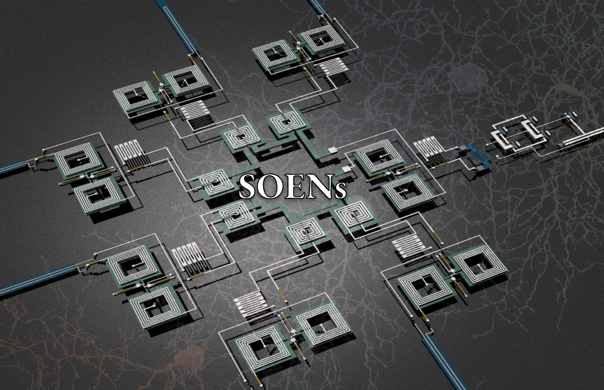

# Superconducting Optoelectronic Network Simulator

Superconducting Optoelectronic Networks (SOENs) are an in-development neuromorphic hardware that offer *lightspeed communication* and *brain-level scalability*.\
This repo is for the coders, neuroscientists, and machine-learners that want to play with the computational properties of SOENs through simulations, based on the phenomological model linked here:
 - https://arxiv.org/abs/2210.09976

For the interested hardware afficianados and device physicists, explanatory materical can be found:
 - https://aip.scitation.org/doi/full/10.1063/1.5096403

Enjoy!

## Getting Started
 - Clone this repo
   - Type the following in the command line of your desired local directory
   - `git clone https://github.com/ryangitsit/sim_soens.git` 
 - Be sure to have the necessary python packages with the following commands (setup for python v3.10 -- may have to manually add packages otherwise)
   - `pip install -r requirements.txt` 
   - To use the `backend=julia` feature when simulating a network (slower call, much faster runtime), julia must be installed as follows (note julia is currently only supported for all bias currents = 1.8):
    - Download julia v1.6.7 either from comman line or website as follows and be sure to add julia to you environment variables 
      - https://julialang.org/downloads/platform/
      - https://julialang.org/downloads/
     - While in the `julia_setup` directory of this repo, run the following command arguments in order:
       - `python run_first_py4jul_setup.py`
         - Be sure to check that julia is accessing the correct version of Python (if there are multiple on the machine)
       - `julia run_second_julia_setup.jl`
 - Open `NICE_tutorial` for a simulator walkthrough 
   - How to use jupyter notebooks: https://www.dataquest.io/blog/jupyter-notebook-tutorial/
   - Or just use the jupyter extension in the vscode IDE
 - Read the docs!
   - https://sim-soens.readthedocs.io/en/latest/

## System Flow

## Features
 - Neurons
   - Any possible SOEN neuron morphology can be called through the `SuperNode` class
   - Generic neurons callable from the `NeuronLibrary`
 - Networking
   - Hand craft networks with specified connectivity using `SuperNet` 
   - Or call on pre-made nets with `NetworkLibrary`
 - Input
   - Custom input with `SuperInput`
   - Canonical datasets can be called natively using `InputLibrary`
     - Random
     - Defined
     - Neuromorphic MNIST
     - Saccade MNIST
 - Visualization tools
   - Neuron morphologies
   - Dendrite behavior
   - Network structure and activity

# *Enjoy!*
